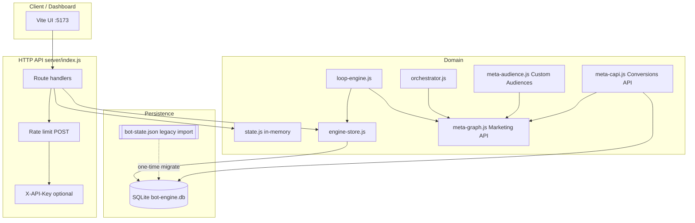

# Travel ROI Meta Bot — Backend Blueprint

Sinhala: මෙය backend එකේ **schema**, **API surface**, සහ **data flow** සාරාංශයයි.

---

## 1. High-level architecture

---

## 2. SQLite schema (engine DB)

**File:** `data/bot-engine.db` (or `ENGINE_DB_PATH`).  
**Migration:** version `1` in `server/db/sqlite.js`.

| Table | Purpose |
|--------|---------|
| `schema_migrations` | Applied migration versions |
| `engine_funnel` | Single row (`id=1`): funnel counters — `view_content`, `lead_count`, `qualified`, `booking` |
| `engine_settings` | Single row (`id=1`): `tracking_health` |
| `engine_jobs` | Ad pipeline / job JSON blobs (`job_json`), capped ~200 |
| `engine_decisions` | Loop / decision log (`decision_json`), capped ~300 |
| `engine_crm_log` | CRM append log (`log_json`), capped ~500 |
| `engine_meta_campaigns` | PK `(campaign_name, adset_name)` → Meta IDs for hydration |
| `engine_performance` | PK `meta_adset_id` — spend, funnel metrics, `revenue`, `cogs`, `currency` |
| `engine_revenue_events` | PK `order_id` — idempotent revenue rows (`event_json`) |
| `engine_crm_quality` | Lead quality events (`event_json`) |
| `engine_capi_log` | CAPI send proof: `event_id`, `event_name`, `pixel_id`, `http_status`, `response_json` |
| `engine_scale_history` | PK `meta_adset_id` — last scale time + budget (minor units) |
| `engine_audience_sync` | Audience sync audit (`segment`, `audience_id`, `matched_users`, `detail_json`) |
| `meta_targeting_catalog` | Cached Graph `targetingsearch` rows (`meta_id`, `search_type`, `search_q`, …) |

**Legacy:** If DB is empty and `data/bot-state.json` exists, `initEngineStore()` imports it once.

---

## 3. HTTP API surface

Base: `http://localhost:${API_PORT}` (default **3001**).

**Auth:** If `API_KEY` is set, all **POST** routes require header `X-API-Key: <API_KEY>`.  
**Rate limit:** POSTs per IP per minute — `RATE_LIMIT_MAX_PER_MIN` (default 120).  
**CORS:** `CORS_ORIGINS` allowlist.

| Method | Path | Notes |
|--------|------|--------|
| GET | `/api/dashboard/state` | Full dashboard payload (in-memory `state` + engine snapshot) |
| GET | `/api/meta/health` | Meta config / mode |
| GET | `/api/meta/targeting-search` | Query: `q`, `type` (e.g. adinterest), `limit` — Graph `targetingsearch`; live caches in `meta_targeting_catalog` |
| POST | `/api/meta/track` | In-memory tracking + funnel bump |
| POST | `/api/pipeline/run` | Full ad pipeline (orchestrator) |
| POST | `/api/preview/render` | Ad preview |
| POST | `/api/loop/tick` | Optimizer loop tick |
| GET | `/api/content/video-script` | Query: `persona`, `destination`, `offer` |
| GET | `/api/policy` | Publish policy |
| GET | `/api/business/summary` | Aggregated business KPIs (incl. `cogs`, `grossProfit`, `profitRoas`) |
| POST | `/api/meta/upload-image` | Graph ad image |
| POST | `/api/meta/upload-video` | Graph video |
| POST | `/api/meta/create-creative` | Link / carousel / video creative |
| POST | `/api/meta/create-campaign` | Campaign chain (live or mock) |
| POST | `/api/meta/sync-audience` | Live: `emails[]` → Custom Audience + hash upload; mock without emails |
| POST | `/api/meta/capi/event` | Server-side CAPI event (logged to `engine_capi_log`) |
| GET | `/api/meta/capi/log` | Query: `limit` — recent CAPI log rows |
| GET | `/api/meta/insights` | Ad account insights + reconcile |
| POST | `/api/meta/optimize` | Same as loop tick |
| POST | `/api/crm/webhook` | CRM events; optional `CRM_WEBHOOK_SECRET` + `X-Webhook-Signature: sha256=...` |
| POST | `/api/crm/quality` | Lead quality → performance |
| POST | `/api/revenue/record` | Revenue (+ optional `cogs`) — idempotent by `orderId` |

---

## 4. External Meta surfaces

| Surface | Module | Env / IDs |
|---------|--------|-----------|
| Marketing API (Graph) | `meta-graph.js` | `META_ACCESS_TOKEN`, `META_AD_ACCOUNT_ID`, `META_PAGE_ID`, `META_PIXEL_ID`, `META_API_VERSION` |
| Custom Audiences | `meta-audience.js` | Same token + ad account |
| Conversions API | `meta-capi.js` | Pixel ID + token (POST `/{pixel-id}/events`) |

---

## 5. Loop / scaling (safe scale)

**Env:** `LOOP_APPLY_META`, `LOOP_APPLY_SCALE`, `LOOP_SCALE_MIN_MINOR`, `LOOP_SCALE_MAX_MINOR`, `LOOP_SCALE_PERCENT`, `LOOP_SCALE_COOLDOWN_MS`.

**Flow:** `loop-engine.js` reads actions from `state.optimizerActions` → optional Graph pause/scale → `engine_decisions` + scale history in SQLite.

---

## 6. Margin-aware optimizer

**Env:** `MARGIN_AWARE_OPTIMIZER`, `OPTIMIZER_CPA_MAX`, `OPTIMIZER_ROAS_MIN`, `OPTIMIZER_PROFIT_ROAS_MIN`, `OPTIMIZER_MIN_LEADS_SCALE`.

**Logic:** `state.js` `recalculateActions()` — when margin mode and COGS present, scale decision uses profit ROAS vs revenue ROAS.

---

## 7. Module map (server)

| File | Role |
|------|------|
| `index.js` | HTTP server, routing, CORS, rate limit, webhook verify |
| `state.js` | In-memory demo/dashboard state + `recalculateActions` |
| `engine-store.js` | SQLite persistence API used by routes + loop |
| `db/sqlite.js` | DB open, WAL, migrations, CAPI log helpers |
| `meta-graph.js` | Graph form GET/POST helpers |
| `meta-audience.js` | Audience create + hashed email upload |
| `meta-capi.js` | CAPI send + log |
| `loop-engine.js` | Loop tick + Meta pause/scale |
| `orchestrator.js` | Pipeline jobs, idempotency |
| `insights-sync.js` | Insights → campaign rows |
| `policy.js` | Publish gating |
| `scheduler.js` | Cron |
| `scaling-config.js` | Budget clamps |
| `rate-limit.js` | In-memory rate limit |
| `webhook-verify.js` | CRM HMAC |

---

## 8. Tests

- `npm run test` — Vitest (`server/*.test.js`).

---

*Generated to match the codebase under `server/` and `docs/`.*
